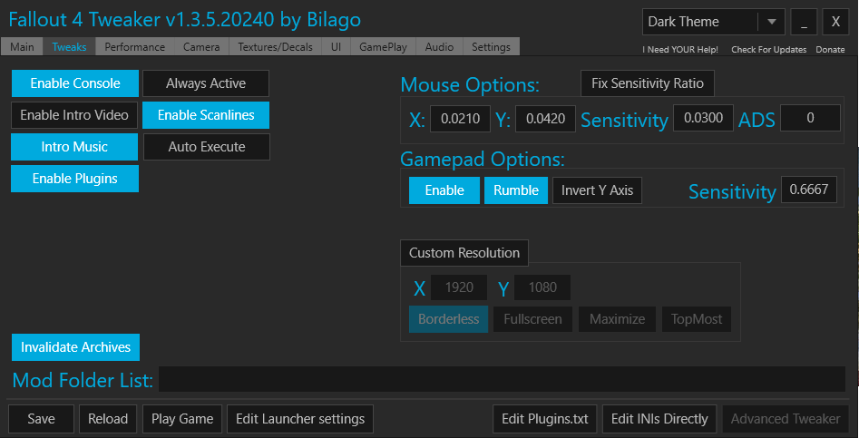

* Current build version of Wabbajack. This can be found on the Wabbajack Discord linked above.

* Clean install of Fallout 4, with all DLCs **except **HD DLC. Non-negotiable.

* A Nexusmods account. Premium is highly recommended for automatic download support.

* 50 Gb of space. 22 Gb for the downloads folder, and 28 Gb for the actual install.

Once Fallout 4 is installed, **make sure you run it once**. (Get to the Fallout 4 splash screen, and exit).

* Go to [BiRaitBec’s Modding Guide.](https://www.nexusmods.com/fallout4/mods/23556?tab=description)

* Manually download the WorkBase file.

* Manually download the Main Repack files (Part One, Part Two, and Part Three).

* Extract the WorkBase file with 7zip.

* Inside of the Workbase folder, create 2 folders called 'OriginalBa2' and 'PatchedBa2'.

* You should have three folders inside of Workbase: OriginalBa2, PatchedBa2, and PatchedFiles.

* Navigate to your Fallout4/Data folder, Cut or Copy (Depending on how much space you have) these 15 files:

1. 'Fallout4 - Textures1.ba2'

2. 'Fallout4 - Textures2.ba2'

3. 'Fallout4 - Textures3.ba2'

4. 'Fallout4 - Textures4.ba2'

5. 'Fallout4 - Textures5.ba2'

6. 'Fallout4 - Textures6.ba2'

7. 'Fallout4 - Textures7.ba2'

8. 'Fallout4 - Textures8.ba2'

9. 'Fallout4 - Textures9.ba2'

10. 'DLCworkshop01 - Textures.ba2'

11. 'DLCworkshop02 - Textures.ba2'

12. 'DLCworkshop03 - Textures.ba2'

13. 'DLCRobot - Textures.ba2'2

14. 'DLCCoast - Textures.ba2'

15. 'DLCNukaWorld - Textures.ba2'

* Paste these files into your WorkBase/OriginalBa2 folder.

* Extract all three Main Repack files.

* Move and combine the "Textures" folders from these extracted archives into the "PatchedFiles" folder.

* Run the installer.bat file inside of WorkBase.

* When it is done, cut and paste all of the files inside of the PatchedBa2 folder into your Fallout4/Data folder.

* Navigate back to the WorkBase folder.

* After all of these steps are complete, you may delete the WorkBase folder.

*Note that you ***_CANNOT _***use the HD DLC for BiRaitBec’s texture optimization. You’ll see missing textures everywhere if you do.*

# 

* Download the latest version of Wabbajack.

* Create a new folder at the root of a drive (Example: D:\Wabbajack).

* Place the Wabbajack.exe into this new folder.

* Download the newest Boston Cream Pie file from the "Browse Modlists" menu

* Launch Wabbajack.exe

* Select "Install a Modlist"

* Choose the BostonCreamPie.wabbajack file you just downloaded.

* In "Installation Location" choose a blank folder at the root of a drive (example: D:\Boston Cream Pie). This location **CANNOT** be where you have the Wabbajack.exe located.

* The "Download Location" will update automatically. You can change it if you wish.

* Click the "Play" arrow.

* Make sure to accept the Nexus API request if your browser asks for it.

* When Wabbajack completes the installation (you can check the Wabbajack.exe.log to confirm it completed successfully), you may close the program.

* Navigate back to your Boston Cream Pie installation folder.

* Open "Game Folder Files"

* Copy everything in this folder.

* Paste it into your Fallout 4 directory (steam/steamapps/common/Fallout 4).

**_Optional Mods:_**

* If you would like the game to be more difficult, enable Wasteland Ballistics, and Fallsouls.

* If you have an Ultrawide monitor, enable the TruBy9 UltraWide Fallout 4 patch to fix issues with UI scaling

* Navigate to your Boston Cream Pie directory.

* Open the "Tools" folder, then the “[Fallout 4 Configuration Tool](https://www.nexusmods.com/fallout4/mods/102)” folder.

* Right-click "Fallout4ConfigTool.exe" and Run as Administrator.

* When FO4Config launches, navigate to the Settings tab.

* Make sure your filepaths align with where you have Boston Cream Pie installed, as shown below. Your folder names may be different.

Next, navigate to the Tweaks tab. Make your screen matches the one shown below. You can change sensitivity options if you like. Make sure your game resolution here matches your monitor’s resolution.

Next, navigate to the Performance tab. Again, make sure the options on your screen match what’s in the image below.

Note: If you ran FO4Config through MO2’s executables, you will need to exit out and run the exe as Administrator to enable the "High Priority" option.

Navigate to the Camera tab next. Keep making the images match what you see.

Some prefer their Field of View at 80, 85, or 95. It’s up to you.

Onward to the Textures tab. You know what to do.

This is entirely optional. If you want to see different colors instead of the standard green in your pipboy, click the "Disable FX" option and select a color of your choosing.

Gameplay tab! The difficulty numbers correspond with the in-game difficulties. 3 is Hard. If you want Normal, drop it to 2. The higher the number, the higher the difficulty.

Note: I know "All NPC’s Killable" is tempting, but you **will** break a lot of quests and scripts if you play this way.

Click "**Save**" in the bottom left.

**That’s almost it! **Launch Mod Organizer 2 inside the Boston Cream Pie folder. From now on, launch Fallout 4 via the "F4SE" option.

If you want to avoid the hassle of future updates from Bethesda, open Steam, right-click Fallout 4 in your Library, open Properties, go to the Updates tab, and change the Automatic Update option to "Only update this game when I launch it." Make sure Steam is launched and logged in before launching Fo4 with F4SE or else Steam will launch the native way and force an update should there be one available. Since we’re always launching from F4SE, it will never automatically update again should you do as I have just instructed.

After the intro movie, click ‘Don’t Show Update Messages Again’ on the Wasteland Imports menu. 

After creating your character, wait for all messages to stop appearing in the top left corner, and open the Mod Configuration Menu and apply these settings:

FallSouls (Only if activated as optional addon)

-MessageBoxMenu -- OFF

-TerminalMenu -- OFF

SPECIALMenu -- OFF

Workshop Framework

* Message Options

    * Suppress Messages During Combat - ON

Workshop Plus

* Options

    * Autosave Timer 5

Then, save and restart your game if you have FallSouls activated. Load back in, and proceed through the door to continue.

Now, we still have a little bit of work left to do, but we’re almost done. Now we can launch the game. Once you finish character customization, you’ll have three options when you try to leave.

* **This is a dream**: You will wake up in Vault 111. Nora is not your wife. Codsworth is not your robot. You’re just a random Pre-war Sanctuary citizen.

* **This is a memory, I don’t want to relive this**: You wake up in Vault 111 as Nate or Nora. Everything else is normal.

* **This is a memory, stay here a while**: Vanilla Fallout 4 intro.

After you open the Vault door, two menus will open. On the first menu, select ‘Main Menu [default]. Select ‘Only for NPC’s’ on the second menu.

When the LAER menu appears, select ‘No (Only placed LAERs are acquirable)’

After you leave the Vault, you will want to open the SKK Combat Stalkers Holotape in your inventory, and enable the first two options, then scroll down and click the ‘Submit’ option to start the scripts for that mod.

**0.2.3 **- Mod Removal

Removed Mod:

* Fallout 4 HD Reworked Project Revised - It causes more problems than it solves. Will most likely add back in a future update.

**0.2.2 **- More bug fixes and things!

Changes:

* Updated This Is Trash and High FPS Physics Fix to latest version

Fixes:

* Fixed graphical issue in Diamond City near the wall.

New Mods:

* Crafting Mastery

**0.2.1 - **Bug fixes and changes!

Changes:

* Switched Wasteland Ballistics basic version to Vanilla Lasers version, as laser musket was super over powered.

* Change MP5 and MP40 base ammo to 9mm, as that is the ammo it used in Fallout Tactics, and IRL.

Fixes:

* Removed crafting recipes for free .50 AE ammo, free Enclave Armor, and Pasta Ammo

New Mods:

	Weapon Mods:

* Bulldog Revolver

* HK G3 family with see-through scopes update

Animation Mods:

* Fiddler's Deliverer Animation Replacer

* Double Action Revolver

* Battlefield 1 Animation Pack - Hunting Rifle

**0.2.0** - Animations and more settlements!

New Mods:

	Settlement Mods:

This Is Trash - A Scrapping Alternative

Capital Wasteland Workshop Pack

Reginalds PreFab ShackFest

Settlement Objects Combined - Lore Friendly

Animation Mods:

10mm Pistol Reanimation Pack

Reanimation Pack for Combat Shotgun and Rifle

Battlefield 1 Animation Pack - Double Barrel Shotgun

P220 Animation Overhaul

Fiddler's Beretta M9FS Animation Overhaul

Fixes:

Add power armor patch for AWKCR to fix missing power armor pieces in workbench

Changes:

Moved Fallsouls and Wasteland Ballistics to Optional with the Ultrawide patch

Updates:

Updated UFO4P to latest version

**0.1.1** - Fixes and things!

New Mods:

M1928A1 Thompson - Day of Infamy

HN66s and XAZOMNs Distinctive Teeth for FO4

HN66s and XAZOMNs Distinctive Teeth Unique to Player

cVc Dead Wasteland

Removed Mods:

Thompson SMG Replacer

Changes:

Fixed load order

**0.1.0** - Gameplay and small settlement update!

New Mods:

Fallsouls - Unpaused Game Menus

Critical Hits Outside of VATS

Wasteland Ballistics

SKK Combat Stalkers

Extended Dialogue Interface

TruBy9 UltraWide Fallout 4 - provides support for ultrawide monitors

G2M - Workshop

Gruffydd’s Signs and Posters

Workshop Framework

Workshop Plus

High FPS Physics Fix

Changes:

Removed 9mm Ammo from the vault.

**0.0.5**

Update to Wabbajack 2.0

Update UFO4P

**0.0.4**

Removed Mods:

No Legendary Screen - Conflicts with literally everything, and breaks things it shouldn’t even touch.

Fixes:

Fixed many back-end errors with weapon mods, and removed unused assets. 

Removed OP armor originally found near the beginning of the game.

Reduced damage of base AUG to levels consistent with vanilla assault rifle.

**0.0.3**

New:

Compatibility patch for Everyone’s Best Friend and UFO4P 

Fixes:

Small load order and patch fixes in xEdit

**0.0.2** - A new challenger approaches….BUGS!

Update to Wabbajack 1.1.3

Removed:

* Ketaros Magazines - Cell errors

* Ketaros Trading Cards - Cell errors

* Combat Zone Restored - Performance inconsistent, works for some but not all.

Added:

* Ketaros Treasures

Bug Fixes:

* Cleaned DLC ESMs

* Cleaned some other mods with problems

* Fixed Power Armor 1st Person Weapons not working issue

**0.0.1** - Initial Release

